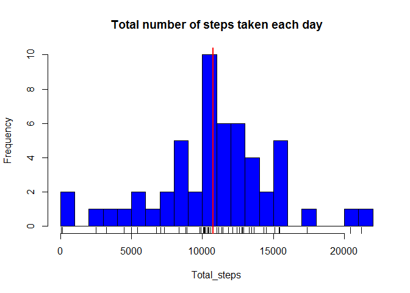
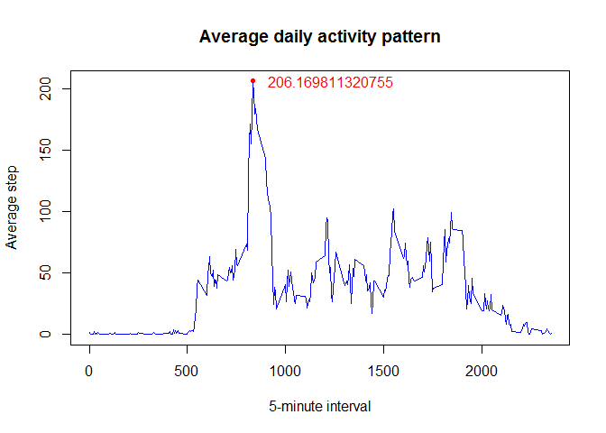
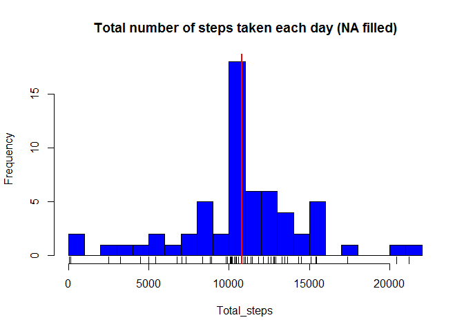
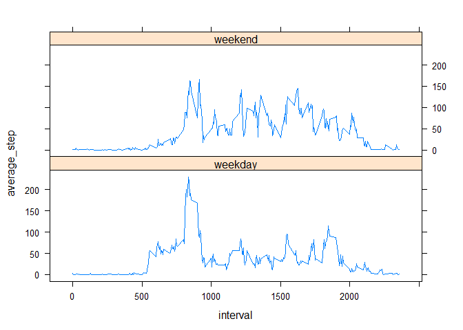

# Reproducible Research: Peer Assessment 1

### Introduction
This report is about the computation of personal activity monitoring device.  
The data consists of two months of data from an anonymous individual collected 
during the months of October and November, 2012 and include the number of steps 
taken in 5 minute intervals each day.

### Prerequisite

Please download [Activity monitoring data](https://d396qusza40orc.cloudfront.net/repdata%2Fdata%2Factivity.zip) 
and move to your working directory if you want to run the code.

### Begin analysis
#### Question 1: What is mean total number of steps taken per day?

Before we begin analysis to answer this question, 
load the library the we will use in this report.

```r
if("dplyr" %in% rownames(installed.packages()) == FALSE){
        install.packages("dplyr")
}
library(dplyr)
```

Now we are ready to go! First, we have to load the data.

```r
raw_ds <- read.csv("activity.csv")
```

Second, we transform the data for easier analysis.  
We group the data by date and find the summarization of steps 
using `sum()` function.  
*Note that I ignore/remove the missing value from calculation.*

```r
my_ds <- tbl_df(raw_ds)
my_ds1 <- my_ds %>%
        group_by(date) %>%
        filter(!is.na(steps)) %>%
        summarize(total_steps = sum(steps))
```

We make a histogram from transformed data with mean as red line.

```r
hist(my_ds1$total_steps, col="blue", breaks=20, xlab="Total_steps", 
     main="Total number of steps taken each day")
rug(my_ds1$total_steps)
abline(v = mean(my_ds1$total_steps), lwd=2, col="red")
```

 

And here is the summary report of NA ignored dataset contains mean and median.

```r
summary(my_ds1)
```

```
##          date     total_steps   
##  2012-10-02: 1   Min.   :   41  
##  2012-10-03: 1   1st Qu.: 8841  
##  2012-10-04: 1   Median :10765  
##  2012-10-05: 1   Mean   :10766  
##  2012-10-06: 1   3rd Qu.:13294  
##  2012-10-07: 1   Max.   :21194  
##  (Other)   :47
```
  
#### Question 2: What is the average daily activity pattern?

We already load data from previous question, so we'll use that data 
and transform them.  
We group the data by interval and find the average of steps
using `mean()` function.  
*Note that I ignore/remove the missing value from calculation.*

```r
my_ds2 <- my_ds %>%
        group_by(interval) %>%
        filter(!is.na(steps)) %>%
        summarize(average_step = mean(steps))
```

Then we make a time series plot from transformed data.  
We also calculate the maximum number of steps of 5-minute interval, 
on average across all the days and plot into graph.

```r
max_avg_step <- max(my_ds2$average_step)
max_interval <- as.numeric(my_ds2[my_ds2$average_step==max_avg_step,][1])
with(my_ds2,plot(interval,average_step, type="l", col="blue", 
                 main="Average daily activity pattern", 
                 xlab="5-minute interval", ylab="Average step"))
with(subset(my_ds2, interval == max_interval), points(interval,average_step,
                                                 col="red",pch=20))
text(max_interval+400,max_avg_step,max_avg_step,col="red")
```

 

The maximum number of steps of 5-minute interval, on average across all the days 
in the dataset is `206.1698113`.  

#### Question 3: Imputing missing values.

We calculate the total number of missing values in the dataset 
using dataset we already load in question 1.

```r
nrow(raw_ds[is.na(raw_ds$steps),])
```

```
## [1] 2304
```

We will now fill in the NA values and see what makes different from 
previous graph.  
We will use ceiling of mean of 5-minute interval, on average across all the days 
to fill each NA value in each date and interval.

```r
filled_ds <- my_ds
filling_ds <- my_ds2
filling_ds$average_step <- ceiling(filling_ds$average_step)
for (i in 1:nrow(filled_ds)) {
 if (is.na(filled_ds$steps[i])) {
  filled_ds[i,"steps"] <- filling_ds$average_step[filling_ds$interval == 
                                        as.numeric(filled_ds[i,"interval"])]
 }
}
```

Now we do the same transformation method in question 1.  

```r
my_ds3 <- filled_ds %>%
        group_by(date) %>%
        summarize(total_steps = sum(steps))
```

We make a histogram from NA filled data with mean as red line.

```r
hist(my_ds3$total_steps, col="blue", breaks=20, xlab="Total_steps", 
     main="Total number of steps taken each day (NA filled)")
rug(my_ds3$total_steps)
abline(v = mean(my_ds3$total_steps), lwd=2, col="red")
```

 

And here is a summary report of NA filled dataset contains mean and median.

```r
summary(my_ds3)
```

```
##          date     total_steps   
##  2012-10-01: 1   Min.   :   41  
##  2012-10-02: 1   1st Qu.: 9819  
##  2012-10-03: 1   Median :10909  
##  2012-10-04: 1   Mean   :10785  
##  2012-10-05: 1   3rd Qu.:12811  
##  2012-10-06: 1   Max.   :21194  
##  (Other)   :55
```

We will see the different value after imputing the missing value.  

#### Question 4 : Are there differences in activity patterns between weekdays and weekends? 

First we decide what date is weekday or weekend.

```r
my_ds4 <- filled_ds
my_ds4$day_type <- as.factor(weekdays(as.Date(my_ds4$date)))
my_ds4$day_type <- factor(my_ds4$day_type, levels = c("Monday","Tuesday",
                        "Wednesday","Thursday","Friday","Saturday","Sunday"))
levels(my_ds4$day_type) <- c("weekday","weekday",
                             "weekday","weekday","weekday","weekend","weekend")
```

Now we do the same transformation method in question 2.

```r
my_ds4 <- my_ds4 %>%
        group_by(interval,day_type) %>%
        summarize(average_step = mean(steps))
```

Then we make a time series plot from NA filled dataset using lattice plot.

```r
if("lattice" %in% rownames(installed.packages()) == FALSE){
        install.packages("lattice")
}
library(lattice)

xyplot(average_step ~ interval | day_type, data = my_ds4, 
       layout = c(1,2), type="l")
```

 
